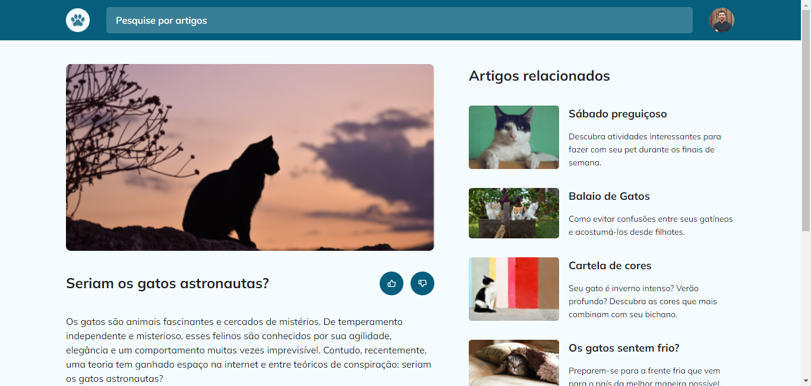
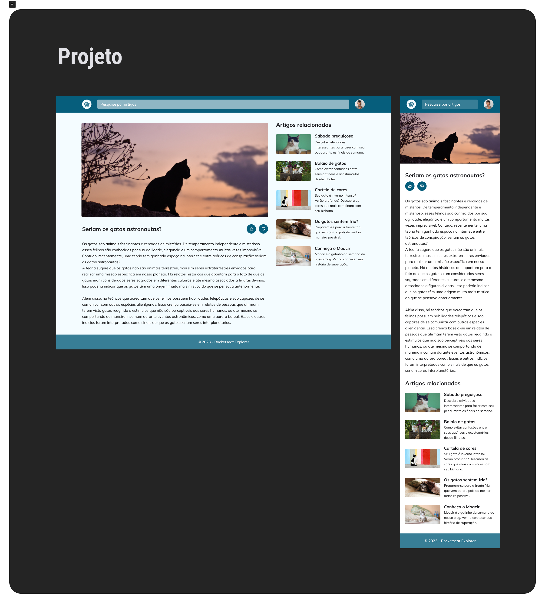

<h1 align="center">🐾 Blog do Gato! 🐾</h1>

Criação de um site web seguindo as instruções do design do figma. Esse projeto foi desenvolvido no programa <a href="https://www.rocketseat.com.br/explorer">Explorer</a> da RocketSeat.

  <a href="#🚀-tecnologias">Tecnologias</a>&nbsp;&nbsp;&nbsp;|&nbsp;&nbsp;&nbsp;
  <a href="#💻-projeto">Projeto</a>&nbsp;&nbsp;&nbsp;|&nbsp;&nbsp;&nbsp;
  <a href="#🔖-layout">Layout</a>&nbsp;&nbsp;&nbsp;

 

  

## 🚀 Tecnologias

Esse projeto foi desenvolvido com as seguintes tecnologias:

- HTML e CSS
- Figma

## 💻 Projeto

O site Blog do Gato é um projeto que tem como objetivo ensinar os fundamentos essenciais de HTML e CSS para criação de sites com grid e aplicar animações nos elementos da página. Além disso, concentramos nossos esforços em garantir que o código seja desenvolvido de maneira semanticamente correta e que a página tenha acessibilidade ideal.

<h1 align="center">
  Funcionalidades
</h1>

- Template Grid
- Responsividade (MobFirst)
- Animações CSS

## 🔖 Layout

Você pode visualizar o layout do projeto através [DESSE LINK](<https://www.figma.com/file/TmWPQS1pIOXD6GD5r9PBKP/Blog-de-Gatos-%E2%80%A2-Desafio-Explorer-(Community)?type=design&node-id=358-622&mode=design&t=Hfi7cUKP3xYFETWB-0>). É necessário ter conta no [Figma](https://figma.com) para acessá-lo.

