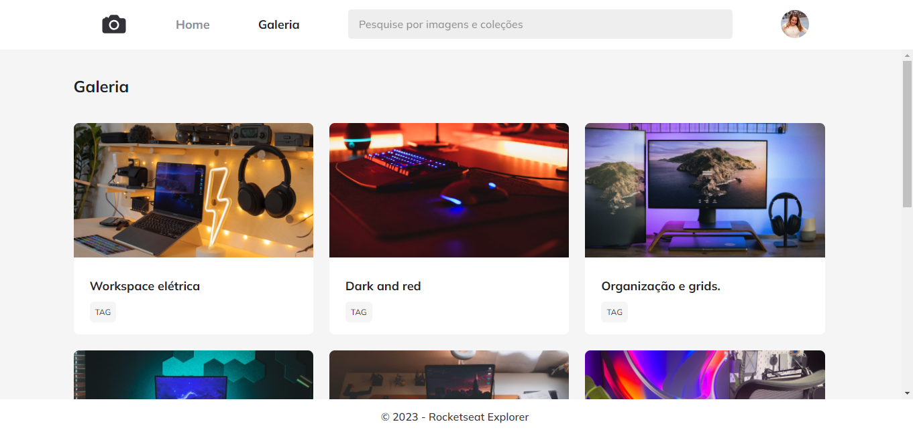

<h1 align="center">📷 Photo Gallery! 📷</h1>

Creation of a web page following the design instructions from Figma. This project was developed in the <a href="https://www.rocketseat.com.br/explorer">Explorer</a> program by RocketSeat.

  <a href="#🚀-technologies">Technologies</a>&nbsp;&nbsp;&nbsp;|&nbsp;&nbsp;&nbsp;
  <a href="#💻-project">Project</a>&nbsp;&nbsp;&nbsp;

 

  

## 🚀 Technologies

This project was developed with the following technologies:

- HTML and CSS
- Figma

## 💻 Project

The Photo Gallery website is a project that aims to teach the essential fundamentals of HTML and CSS for creating grid-based websites and applying animations to page elements. Additionally, we focused our efforts on ensuring that the code is developed in a semantically correct way and that the page has optimal accessibility.

- [Access the finished project online](https://jp-xaxa.github.io/explorer-stage-3/galeria/)

<h1 align="center">
  Features
</h1>

- Grid Template
- CSS Animations
